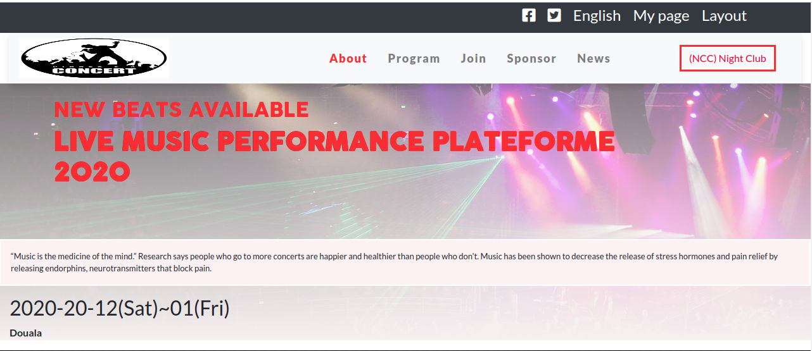

##  I have build a live musical performance plateform.

This project has created as a part of the Microverse Collaborative Project.

## Screenshot

## Built With

* HTML
* CSS
* BootStrap
* VS Code 

## Live Demo

<a href="https://frederickmih.github.io/Concert/">Here</a>

## Getting Started

To get a local copy up and functioning, follow these simple example steps.

### Prerequisites

You must have a text editor installed on your machine.
You can use any default text editor that comes with the system like Notepad but advanced text editors
as Visual Studio Code, Atom, Sublime is recommended.

### Setup

* Clone the repository to your folder of choice using Git :

* <code>git clone https://github.com/FrederickMih/Concert.git:</code>

* Then go to that folder using the commands below. Let us say the intended folder where the project cloned

  is 'Fred' then navigate to Fred's directory by using its absolute path:

* <code>cd /home/username/Fred</code>

* Open the index.html file (in the Fred folder) the website should show up.

* GitHub: [@FrederickMih](https://github.com/FrederickMih)

## 🤝 Contributing

Contributions, issues, and features requests are welcome!

Feel free to check the [issues page](issues/).

## Show your support

Give a ⭐️ if you like this project!

## Acknowledgments

* Thank to [Cindy Shin](https://www.behance.net/gallery/29845175/CC-Global-Summit-2015), for her best design materials

* Thank you Microverse to giving us this chance to learn :)

## 📝 License

This project is [MIT](lic.url) licensed.
