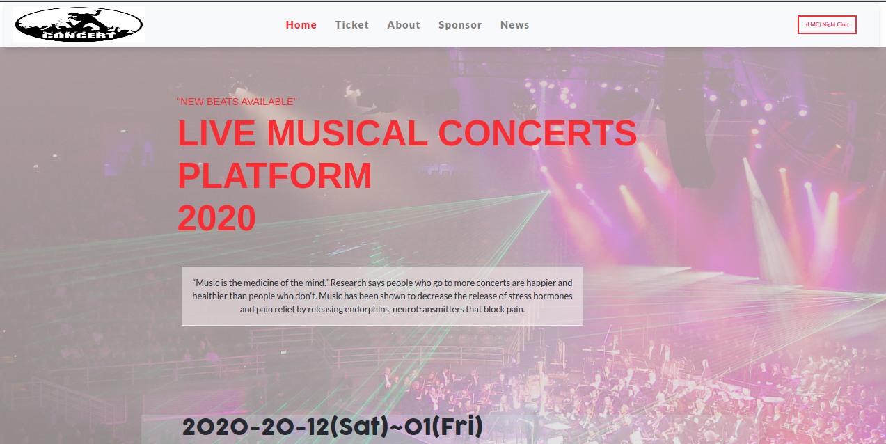

##  Live Musical Concert Platform 2021.

# [Solo Capstone Project]

This project has created as a part of the Microverse Collaborative Project.
The original specifications of the project can be found 
<a href="https://www.notion.so/HTML-CSS-capstone-project-Conference-page-ed3efca4b9824484a9df7f9f24067ff7">here</a>

## Author

# Mih Frederick Ngum

## Screenshot

## Built With

* HTML
* CSS
* BootStrap
* VS Code 

## Link to live demo

<a href="https://frederickmih.github.io/Concert/">Click here</a>

## Getting Started

To get a local copy up and functioning, follow these simple example steps.

### Prerequisites

You must have a text editor installed on your machine.
You can use any default text editor that comes with the system like Notepad but advanced text editors
as Visual Studio Code, Atom, Sublime is recommended.

### Setup

* Clone the repository to your folder of choice using Git :

* <code>git clone https://github.com/FrederickMih/Concert.git:</code>

* Then go to that folder using the commands below. Let us say the intended folder where the project cloned

  is 'Fred' then navigate to Fred's directory by using its absolute path:

* <code>cd /home/username/Fred</code>

* Open the index.html file (in the Fred folder) the website should show up.

* GitHub: [@FrederickMih](https://github.com/FrederickMih)

## 🤝 Contributing

Contributions, issues, and features requests are welcome!

Feel free to check the [issues page](issues/).

## Show your support

Give a ⭐️ if you like this project!

## Acknowledgments

* Thank to [Cindy Shin](https://www.behance.net/gallery/29845175/CC-Global-Summit-2015), for her best design materials

* Thank you Microverse to giving us this chance to learn :)

## 📝 MIT License

&copy; 2021 Mih Frederick Ngum.

* Permission is hereby granted, free of charge, to any person obtaining a copy
of this software and associated documentation files (the "Software"), to deal
in the Software without restriction, including without limitation the rights
to use, copy, modify, merge, publish, distribute, sublicense, and/or sell
copies of the Software, and to permit persons to whom the Software is
furnished to do so, subject to the following conditions:
  

* The above copyright notice and this permission notice shall be included in all
copies or substantial portions of the Software.

* THE SOFTWARE IS PROVIDED "AS IS", WITHOUT WARRANTY OF ANY KIND, EXPRESS OR
IMPLIED, INCLUDING BUT NOT LIMITED TO THE WARRANTIES OF MERCHANTABILITY,
FITNESS FOR A PARTICULAR PURPOSE AND NONINFRINGEMENT. IN NO EVENT SHALL THE
AUTHORS OR COPYRIGHT HOLDERS BE LIABLE FOR ANY CLAIM, DAMAGES OR OTHER
LIABILITY, WHETHER IN AN ACTION OF CONTRACT, TORT OR OTHERWISE, ARISING FROM,
OUT OF OR IN CONNECTION WITH THE SOFTWARE OR THE USE OR OTHER DEALINGS IN THE
SOFTWARE.